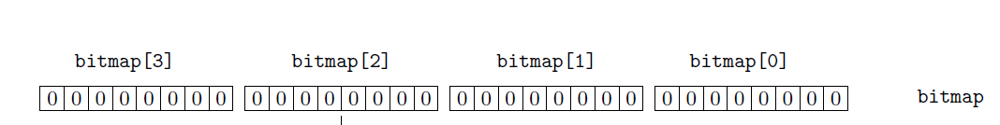

# OS Project 1 Report
#### Authors: ac1771 and tsc95

## Signal Handler

## Bit Operations
### Extracting Top Order Bits
To get the top order bits (most significant ones) for a given value I followed these steps:
- We first need to figure out how many bits there are in the integer. To do this I first copied the value into a temp variable and repeatedly shifted the bits right until we end up with 0 for the temp value.
- Next we subtract the number of bits we want (top order bits) from the total bits in the integer, this is the number of times I want to shift the bits to the right to get the top order bits
- Lastly we just shift the value bits that many times to the right and return the resulting value

### Setting Bits at Index
Given the index of a bit, we needed to change the corresponding bit in an array of characters. Moreover, the array needed to be read from right to left (the same way we read bits), to do this I followed the following steps
- Each character has 8 bits, so first to get the index from the right of the chosen bit, we do an integer divide by 8. By doing so, if the chosen bit is 17, we know to look at the third character from the right in the array. So if the chosen bit is 17, we need to modify `bitmap[2]` since 17/8 = 2.

- To find the exact bit to change within the character, we do a modulo. If we take the same example of the bit to set being 17, we do 17%2 = 1, so therefore the bit to set here would be the second bit from the right.
- Now that we know the index of the character to set and then the bit to set within the character, we first go ahead and retrieve the character. Since arrays are usually indexed from left to right but we need to read the array from right to left, we can calculate the index from the right by using the following formula: `int arr_right_index = BITMAP_SIZE - arr_index - 1;` where bitmap size is the size of the whole array and arr index is the index of the character from the right, we subtract by 1 because the array is zero indexed.
- And after retrieving the correct character, we set the bit by shifting the integer 1 by the index of the bit that we want to set and doing an `OR` operation. This way if the specific bit that we want to set is not already a 1, it will not be a 1, but if has already been set to a 1 then nothing will happen.

And that's it!
### Getting Bits at Index
Now given the index of the bit, we want to retrieve the value. To do this we follow the same first three steps as before
- Find the index of the character from the right and flip it to find the index from the left, then get the index of the bit by doing a modulo.
- Now instead of the last step being an `OR` operation where we set the specified index, we instead use an `AND` here. More specifically, we shift the bits in the character by the index of the bit within the character to get the specified bit to be the right most bit and then do an `AND` with 1 to retrieve the stored bit. If the bit is 0, the `AND` will return 0 and if the bit is 1 the and wil return a 1.